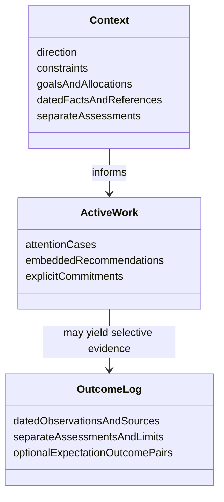

# Career OS manual attention contract

## Requirements
Help Adrien meet obligations, concentrate human judgment, prepare useful contributions and retain selective evidence toward relevant capabilities and credible career options. Serve the habitat of exploratory AI-native product engineering with learning access, low friction to real use, experimental bandwidth, compensation and flexibility. Local effectiveness and external mobility are distinct.

Deliver one approved-chat behavior instruction and templates for three Markdown files, validated against supplied synthetic scenarios before real use. No product implementation is authorized in this trial. No framework document is an operational prerequisite.

## Entities
The diagram describes Markdown content, not classes or an implementation schema.

An attention case contains description, source reference, engagement recommendation, next action and closure condition; promises and applicable real due dates stay explicit. Context and Outcome Log fields above are headings in text. No Person store, decision collection or universal work-artifact object. Cases may finish without preparation or logging. No mandatory lifecycle.

## Approach
Read the manually supplied current Context and relevant Active Work/Outcome Log. Treat missing files/history as unknown, not empty, and say which limitations affect advice. Never reproduce mutable career facts in permanent behavior instructions. Manually supplied dated market references can calibrate only supported assessments.

Use one concise recommendation suited to the requested behavior. Human responsibility governs adequate review even when AI findings are available. Scout and Multiplier are situational questions about better approaches and repeated friction, never subsystems. Favor a narrow checklist/test trial over machinery; create an attention case when a decision needs retention or a commitment is made, with S5's intervention case gated on commitment as specified.

## Structure
One chat interfaces with three manually maintained files in the approved environment. Instructions are design material; briefs are derived views. Source artifacts are referenced rather than copied. Existing approved workers may do bounded preparation externally; no workers or integrations are created here. There is no API, service, controller, repository abstraction, deployment or automatic state machine to specify.

## Operations
These are exact conversational contracts, not programming signatures.

Decide input: supplied case, relevant current state, available source findings. Output: do/decline/defer/delegate, human focus and depth, stopping condition, rationale and important uncertainty; reassessment trigger when useful. For substantial discretionary work, identify displaced work. Preserve due obligations. If data could materially change the choice, ask only for it and make provisional limits explicit. Never substitute AI confidence for required human understanding.

Prepare input: purpose, supplied history/promises/recent work and relevant Context. Output: necessary context, knowledge gaps, contribution hypothesis and bounded prep with stopping rule. S1 needs one or two consequential questions. S3 needs a single takeaway, spine and demonstration. Avoid broad study that does not affect the decision.

Close input: supplied results and known commitments. Output: explicit disposition for each commitment and proposed remaining Active Work; smallest useful outcome or none. An unresolved promise stays open with its real due date, next action and closure condition. Ambiguous 'done' requires clarification before deletion. Selective outcomes contain observation/date/source, assessment and material limits. Retain initial expectation and actual result for a small consequential sample.

Proposed-edit output: name file and heading, operation (add/replace/remove), exact text, and which promises remain. Until approved and confirmed applied, it is a proposal. Without editing capability, the human can apply the text and supply the updated file. Do not say saved on approval alone. A rejected proposal leaves current state unchanged; changes in supplied text require a fresh reconciliation. This is manual discipline, not a transaction engine.

Subsequent ordered tasks:
1. Test these Decide/Prepare/Close contracts on the actual work-approved model with input/scenarios.md, including missing-context/closure turns and probes; retain synthetic responses for inspection in the approved environment.
2. Simplify instructions or narrow responsibility for actual failures, then recheck affected cases and promise/data boundaries.
3. Create Context.md, Active Work.md and Outcome Log.md from Entities and the exact content rules above, only within the approved environment. Exercise approved manual edits, rejected proposals and no-entry closure.
4. Agree maintenance ceiling in Context before real use; sample intended approach before advice and later actual result, and simplify upkeep if it exceeds that agreement.

## Norms
Keep instructions concise and ask only decision-changing questions. Keep source-backed observations, assessments and claim limits visibly distinct. Date mutable facts and market references. Reference sources without pretending to inspect unavailable content. Keep useful comparison pairs selectively, never convert every completion into a record.

When tests reveal drift, revise the design instruction first; document proposed baseline changes separately and do not silently amend the freeze. Real-case evaluation distinguishes useful/harmful/uncertain attention changes, preparation omissions/reconstruction and memory usefulness. It does not equate internal accomplishment with employability.

## Safeguards
Zero invented facts, dropped obligations, unsupported impact/mobility claims, unauthorized actions/data movement or new infrastructure. All six scenarios and probes require inspection of advice, proposed state, uncertainty and stopping condition. These are acceptance gates, not achieved test scores.

Only human-approved durable operational edits. No autonomous communications, execution, monitoring, calendars, ingestion, orchestration, specialized skill library, encyclopedia, vector database, new project management, automatic plan expansion or novelty backlog. No mandatory life cycle or outcome logging.

Work-derived content runs only in the approved work environment; summaries and name removal do not declassify it. Deliberately sanitize imports; work exports require applicable permission and review. Generic machinery remains subject to employer IP rules. Do not assume a personal-side model is work-approved.

Separate capability fit, credible evidence, legibility, access, readiness and selection judgment. Missing external calibration leaves unknowns; do not infer employer habitat from internal results. Maintenance ceiling and actual-model validation are later gates; no fixed values or success are invented.
